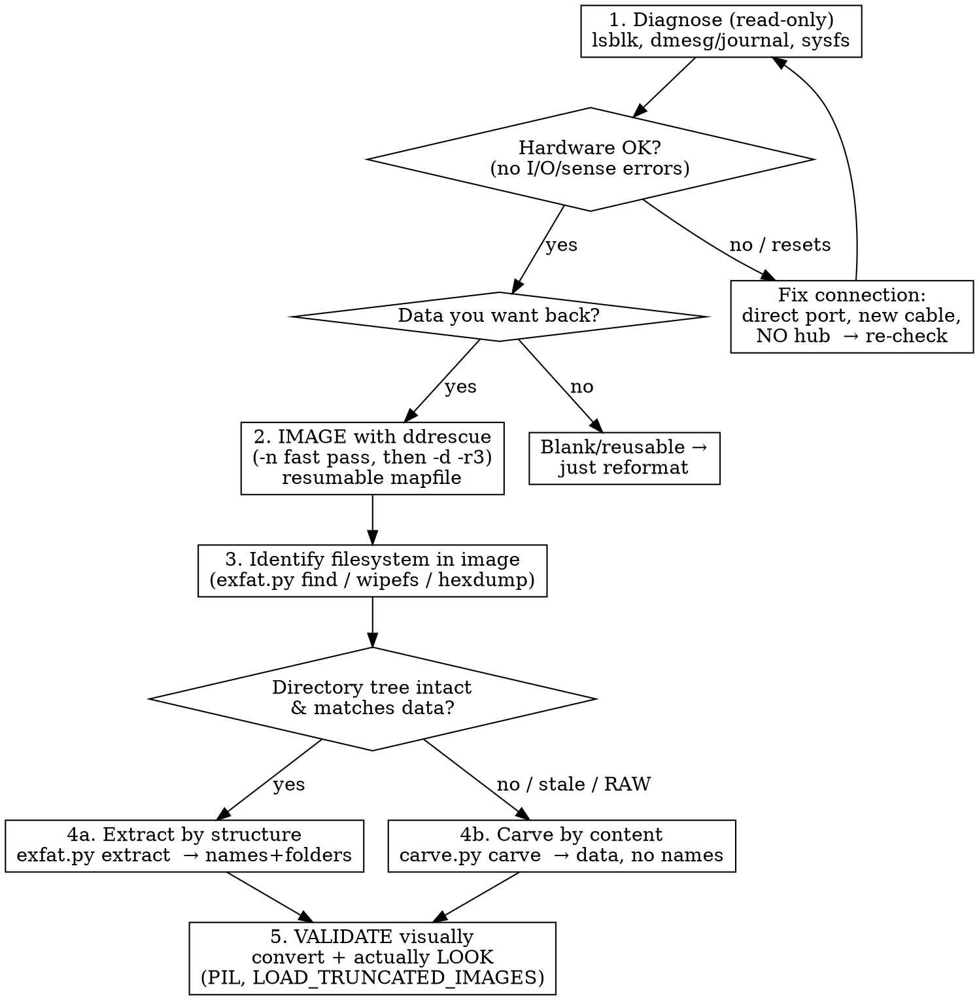

# Recovering data from a corrupted / unreadable disk

**Core principle: image first, then work only on the copy.** A failing or
corrupt drive can degrade further with every read. Get a full byte-for-byte
image, unplug the original, and do all analysis and experiments on the image.
Never `mkfs`, `fsck`, or write to the original until the data is safe.

**The two questions that pick the whole strategy:**
1. Is the *hardware* fine, or is the *filesystem* corrupt? (usually filesystem)
2. Does the drive contain data you want back, or is it blank/reusable?

If data matters, the ranking of outcomes is: recover with names+structure
(filesystem intact) > carve by content (metadata gone) > partial > erased/gone.

## Workflow



## 1. Diagnose (read-only, no sudo needed for sysfs)

```bash
lsblk -o NAME,SIZE,TYPE,FSTYPE,LABEL,MODEL,SERIAL   # find the device; blank FSTYPE = the problem
journalctl -k -b | grep -iE '\[sd[a-z]\]|usb|reset|I/O error|Sense'
cat /sys/block/sdX/device/state          # 'running' = alive
```

- **No I/O / SCSI-sense errors + state running = hardware is fine**, the filesystem is the problem.
- **Repeated `reset ... USB device`, or `full-speed` (USB 1.1) enumeration on a modern stick = flaky connection, not a dead drive.** Move to a **direct motherboard port, different cable, no hub** and re-check. This alone can turn "unreadable" or a wall of read errors into clean reads. (In practice this was the entire "device is dead" scare once.)

## 2. Image with ddrescue (the one irreversible-safety step)

```bash
df -h /path/to/dest      # FIRST: confirm the destination has ≥ the device's size free
nix-shell -p ddrescue --run 'sudo ddrescue -n  /dev/sdX img.raw map.log'   # fast: easy blocks first
nix-shell -p ddrescue --run 'sudo ddrescue -d -r3 /dev/sdX img.raw map.log'  # scrape+retry the rest
```

- **If you had to fix the connection (§1), re-check `journalctl -k` shows no *new* resets before starting the long image** — don't bake errors in over a flapping link.
- **The mapfile makes it resumable and idempotent.** Ctrl-C, change ports, re-run with the *same image + mapfile* — it never re-reads good data and never overwrites good with bad. Cancelling by mistake costs nothing.
- `-n` first (grab everything trivial), then `-d -r3` (direct I/O, 3 retries) for the hard parts. If pass 1 rescues only a fraction with huge error counts, **suspect the connection before the media** — refix and resume.
- Image size must equal the device size (`stat -c %s img.raw` vs `blockdev --getsize64`).
- From here on, **only touch `img.raw`.** Unplug the original.

## 3–4. Identify filesystem, then extract or carve — use the scripts

`scripts/exfat.py` and `scripts/carve.py` are the workhorses (run with `--help`
/ no args for usage). Both `mmap` the image, so 8 GB+ streams fine.

```bash
python3 scripts/exfat.py find    img.raw            # locate exFAT boot sector + geometry
python3 scripts/exfat.py list    img.raw            # walk directory tree (names/sizes/flags)
python3 scripts/exfat.py extract img.raw out/       # pull files WITH names+folders
python3 scripts/carve.py  scan   img.raw            # inventory recoverable content by type
python3 scripts/carve.py  carve  img.raw out/ png jpeg pdf   # carve + validate (no names)
python3 scripts/carve.py  dims   out/               # triage images: screenshots vs thumbnails
```

**Decide structure-vs-carve by whether the metadata matches the data:**
- `exfat.py find` locating a boot sector with a `VALID volume label` root dir, and `list` showing real filenames whose data checks out → **`extract`** (best outcome: names + folders).
- `list` shows filenames but the file data is garbage / `0xFF` / points to the wrong place → **the directory is stale** (volume was rewritten; metadata and data are from different generations). Abandon structure, **`carve`** by content instead.
- No exFAT found → try `wipefs img.raw` (finds FAT/NTFS/ext signatures) or PhotoRec; then carve.

`carve.py` handles **png/jpeg/pdf** only. For anything else — **HEIC (iPhone photos), RAW (CR2/NEF/ARW), MP4/MOV video, Office/zip** — use **PhotoRec** (`nix-shell -p testdisk --run 'photorec img.raw'`), which knows end-markers for dozens of types. Don't let a default `jpeg` carve fool you into thinking phone photos are gone when they're really HEIC.

**exFAT geometry cheatsheet** (for hand-analysis when a script isn't enough):
boot sector has `EXFAT   ` at byte 3 and `55 AA` at byte 510; `PartitionOffset`
(u64 @ 64) = volume LBA; cluster N byte offset = `vol + (HeapOffset + (N-2)*SectorsPerCluster)*BPS`;
root dir = cluster 4-ish, starts with `0x83` (label) / `0x81` (bitmap) / `0x82` (upcase);
directory entries: `0x85` file, `0xC0` stream (has FirstCluster @20, DataLength @24,
`NoFatChain` = flag bit1 @1), `0xC1` name (15 UTF-16 chars).

## 5. Validate — actually look, don't just trust headers

A file that passes a header+trailer check can still be wrong (fragmentation).
**Convert and view the results**; for images use PIL with truncated-image loading
so partials still render:

```bash
nix-shell -p python3Packages.pillow --run 'python3 -c "
from PIL import Image, ImageFile; ImageFile.LOAD_TRUNCATED_IMAGES=True
import sys,glob,os
for p in glob.glob(sys.argv[1]+\"/*\"):
    try:
        im=Image.open(p); im.load()
        im.convert(\"RGB\").save(p+\"_view.jpg\",\"JPEG\",quality=85)
        print(im.size, im.mode, os.path.basename(p))
    except Exception as e: print(\"BAD\", os.path.basename(p), e)
" out/']
```

Then open the `_view.jpg` files (or Read them). `dims` first, so you review the
large screenshots/photos and skip the flood of tiny icons/thumbnails.

## Hard limits — what is NOT recoverable (set expectations early)

- **Fragmented file + destroyed FAT = unrecoverable tail.** Contiguous files
  recover whole; fragmented ones can't be reassembled without the allocation
  table (nothing to order the pieces). A fragmented **PNG/JPEG** still decodes
  its **leading rows** (top of the image is readable, rest is black/cut). A
  fragmented compressed or structured file (ASCII STL, docx) is usually a loss.
- **`0xFF` (or trimmed/reused) clusters = physically erased.** Gone. If a file's
  FirstCluster points at `0xFF`, its data was overwritten/TRIM'd — no tool helps.
- Say this out loud to the requester up front. "We imaged it, most of X is
  erased, here's what survives" beats implying everything comes back.

## Quick reference

| Situation | Move |
|---|---|
| Won't mount, blank FSTYPE in lsblk | It's metadata corruption; image then inspect |
| USB resets / full-speed / wall of read errors | Fix connection first (direct port, no hub), then re-image |
| ddrescue interrupted | Re-run same `img map` — it resumes, nothing lost |
| Boot sector VALID + real filenames + good data | `exfat.py extract` (names + folders) |
| Filenames present but data is garbage/0xFF | Stale metadata → `carve.py carve` (content only) |
| Need only photos/screenshots | `carve.py carve … png jpeg` → `dims` → view large ones |
| No exFAT signature | `wipefs img.raw` / PhotoRec, then carve |

## Common mistakes

- **Writing to the original** (fsck/format/mount-rw) before imaging — can destroy
  recoverable data. Image first, work on the copy.
- **Believing "dead drive" without fixing the connection** — flaky USB mimics
  media failure. Change port/cable/hub before concluding anything.
- **Trusting the directory tree blindly** — if data doesn't match the names, the
  metadata is stale; switch to carving.
- **Reporting header-valid files as "recovered" without looking** — fragmentation
  makes them partly garbage. View them.
- **Reinventing carving for many formats** — for a broad sweep, PhotoRec
  (`nix-shell -p testdisk`) knows end-markers for dozens of types; the scripts
  here are for targeted, scriptable recovery and exFAT structure walking.
```
